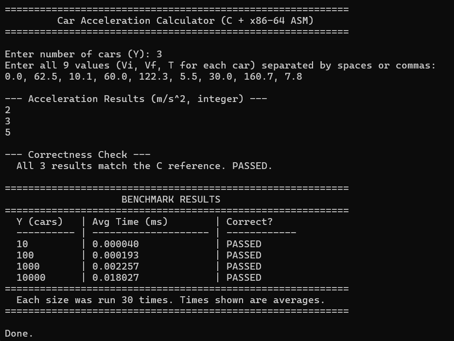

# Car Acceleration Calculator (C + x86-64 Assembly)

A program that computes the acceleration of multiple cars from a velocity/time matrix. The C frontend handles I/O, memory management, and benchmarking. The x86-64 assembly backend performs the actual computation using **scalar SIMD (SSE2) floating-point instructions**.

## Formula

```
Acceleration (m/s²) = ((Vf - Vi) × 1000 / 3600) / T
```

Where:
- **Vi** = Initial velocity (km/h)
- **Vf** = Final velocity (km/h)  
- **T** = Time (seconds)

The result is converted to an integer (rounded to nearest).

## Project Structure

| File         | Language  | Description                                         |
|-------------|-----------|-----------------------------------------------------|
| `main.c`    | C         | Input/output, memory allocation, benchmarking, correctness verification |
| `accel.asm` | x86-64 ASM | Scalar SIMD computation (SSE2: `movsd`, `subsd`, `mulsd`, `divsd`, `cvtsd2si`) |
| `Makefile`  | Make      | Build system                                        |

## Prerequisites

- **NASM** (Netwide Assembler) — [https://www.nasm.us/](https://www.nasm.us/)
- **GCC 64-bit** (MinGW-w64, targeting `x86_64-w64-mingw32`) — [https://www.mingw-w64.org/](https://www.mingw-w64.org/)

## Build Instructions

**Using Make (Recommended):**
```bash
# using MinGW Make
mingw32-make
```

**Manual Compilation:**
```bash
nasm -f win64 accel.asm -o accel.obj
gcc -O2 -Wall -m64 -o lbyarch-mp.exe main.c accel.obj
```

## Running

```bash
lbyarch-mp.exe
```

### Sample Input
```
3
0.0, 62.5, 10.1, 60.0, 122.3, 5.5, 30.0, 160.7, 7.8
```

### Expected Output
```
2
3
5
```

## Execution Time and Performance Analysis

The assembly function was benchmarked over **30 iterations** for each input size.

| Y (cars) | Avg Execution Time (ms) | Correctness |
|-----------|-------------------------|-------------|
| 10        | 0.000040                | PASSED      |
| 100       | 0.000193                | PASSED      |
| 1,000     | 0.002257                | PASSED      |
| 10,000    | 0.018027                | PASSED      |

**Analysis:** As expected, the average execution time increases as the number of cars increases. Although this value may vary because the program benchmark uses wall-clock time and not CPU time. This is not indicative of the actual performance of the program. Just simply run the program again.

## Program Output Screenshots



## Video Demo

*(To be added — 5-10 min video showing source code walkthrough, compilation, and execution)*
